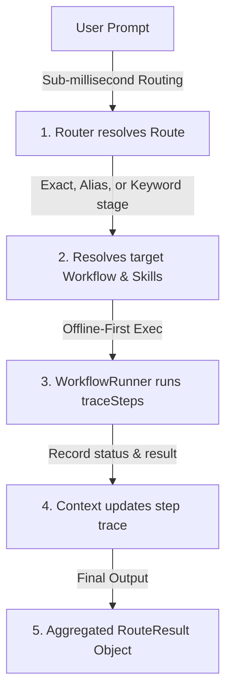

# yes-human

**yes-human is an offline-first AI workflow router that turns natural-language tasks into structured, reusable agent workflows for local apps and AI coding tools.**

> **What it is**: It is the routing, workflow, instruction, and pack layer around Large Language Models (LLMs) and local developer tools.
>
> **What it is NOT**: It is not an LLM. It is not a replacement for Codex, Claude Code, Cursor, or Antigravity. It is the orchestrator and router that runs ahead of them.

---

## Quick Q&A (First Screen Overview)

### 1. What is yes-human?
An offline-first, zero-latency intent router and workflow engine. It parses natural-language prompts locally and maps them to specialized, deterministic agent routines, loading only the needed instructions and rules.

### 2. What problem does it solve?
Using LLMs to route prompts is slow, expensive, and unpredictable. `yes-human` maps user queries to specific workflow IDs in under **0.05ms** with zero network calls, eliminating token overhead, prompt drift, and routing errors.

### 3. Who is it for?
* **Desktop & Desktop-Wrapper App Builders**: Developers building Tauri, Electron, or local React coding assistants.
* **AI Coding Agent Architects**: Team leads standardizing prompt templates and checklists for Codex, Antigravity, or Cursor workspaces.
* **Enterprise Control Planes**: Security leads enforcing local compliance check gates (such as PII redaction and license audits) before prompts leave the local system.

### 4. Why not just use Codex/Antigravity directly?
Codex and Antigravity are powerful execution engines but have no built-in deterministic query-to-intent routing, local safety guardrails, or domain workflow pack registries. `yes-human` organizes your workflows locally and generates the configs Codex and Antigravity need, preventing prompt bloat.

### 5. How does yes-human help reduce prompt waste?
Instead of prefixing every prompt with hundreds of lines of generic instruction markdown (which burns context window tokens and increases billing costs), `yes-human` matches queries locally and only exposes the specific, relevant instruction subset (or Codex/Antigravity skill) required for that task.

### 6. How to install/use SDK?
Install the npm packages:
```bash
npm install @yes-human/core @yes-human/runtime @yes-human/packs
```
Bootstrap the SDK:
```javascript
import { createRouter } from "@yes-human/core";
import { developerPack } from "@yes-human/packs";

const router = createRouter({ packs: [developerPack] });
const result = await router.route("review code changes");
console.log(result.route.workflowId); // "developer.code-review"
```

### 7. How to export Codex skills?
Synchronize your local workflows directly to Codex workspace files:
```bash
npx yes export codex ./my-project
```
This generates `.codex/skills/` (containing Purpose, When to Use, and checklist parameters) and `AGENTS.md`.

### 8. How to export Antigravity skills?
Synchronize workflows to Google Antigravity workspaces:
```bash
npx yes export antigravity ./my-project
```
This generates `agents.md` (team structure) along with standard `skills/` prompts and `workflows/` sequences.

### 9. How offline mode works?
`yes-human` resolves intent routing entirely on the local CPU using deterministic normalization, keyword overlap, and alias maps. It runs fully offline with sub-millisecond execution times. Local document conversion is powered by Microsoft's MarkItDown running on local python environments.

### 10. What packages exist?
* **`@yes-human/core`**: Core router matching algorithms and pack loading primitives.
* **`@yes-human/runtime`**: Workflow runner execution and context tracing.
* **`@yes-human/packs`**: Predefined bundles (default, developer, document, business, security, startup).
* **`@yes-human/adapters`**: Code generation adapters for Codex, Antigravity, and host prompts.
* **`@yes-human/doc-tools`**: Optional document-to-markdown conversion utility.
* **`yes-cli`**: Developer control CLI.

---

## Architecture Pipeline



---

## SDK Integration Guides

* [Getting Started Guide](file:///Users/moramvenkatasatyajaswanth/yes-human/docs/getting-started.md)
* [API Reference Documentation](file:///Users/moramvenkatasatyajaswanth/yes-human/docs/api-reference.md)
* [Architecture Specifications](file:///Users/moramvenkatasatyajaswanth/yes-human/docs/architecture.md)
* [App Integration Blueprints](file:///Users/moramvenkatasatyajaswanth/yes-human/docs/integration-guide.md)
* [Domain Packs Registry](file:///Users/moramvenkatasatyajaswanth/yes-human/docs/packs.md)
* [Codex & Antigravity Exporters](file:///Users/moramvenkatasatyajaswanth/yes-human/docs/adapters.md)
* [Document Conversion Tools](file:///Users/moramvenkatasatyajaswanth/yes-human/docs/doc-tools.md)
* [Routing & Load Benchmarks](file:///Users/moramvenkatasatyajaswanth/yes-human/docs/benchmarks.md)

---

## Runnable Examples

* [Node.js Interactive CLI Assistant](file:///Users/moramvenkatasatyajaswanth/yes-human/examples/node-cli-assistant)
* [React Vite Dashboard Visualizer](file:///Users/moramvenkatasatyajaswanth/yes-human/examples/react-local-app)
* [Electron Offline App Setup](file:///Users/moramvenkatasatyajaswanth/examples/electron-offline-app)
* [Tauri Desktop sidecar Setup](file:///Users/moramvenkatasatyajaswanth/examples/tauri-offline-app)

---

## License

MIT License. See [LICENSE](file:///Users/moramvenkatasatyajaswanth/yes-human/LICENSE) for details.
