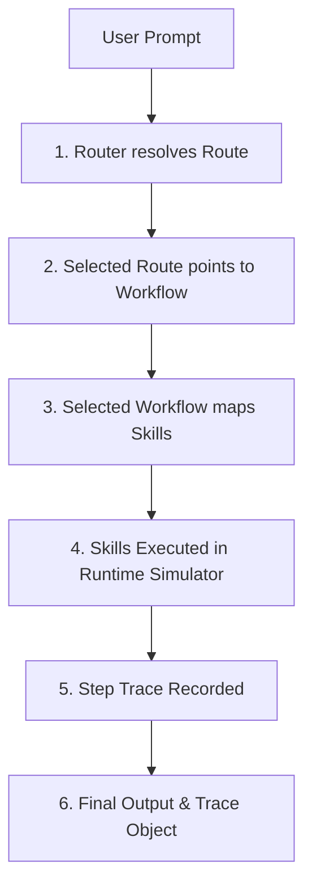

# yes-human

Offline-first AI workflow router for local apps and developer tools.

yes-human turns natural-language tasks into structured agent workflows. It helps local apps, AI coding tools, and developer platforms choose the right workflow, load only the needed instructions, run repeatable skills, and produce traceable outputs.

It is not an LLM. It is the routing, workflow, and instruction layer around LLMs and local tools.

---

## 1. What is yes-human?
An offline-first, zero-latency routing layer that matches user prompts to predefined developer or corporate workflows, loading only the necessary skills and checking compliance.

## 2. Who is it for?
* **Desktop & CLI Tool Developers**: Build local coding tools with consistent AI behavior.
* **AI Coding Agent Builders**: Standardize instructions and workflows for Codex, Antigravity, or Cursor.
* **Enterprise Control Planes**: Enforce auditable compliance gates and trace logging of AI actions.

## 3. Why it exists?
To prevent high routing latency, reduce token consumption in agent prompts, and ensure deterministic, repeatable executions.

## 4. What problem it solves?
LLM-based routing is slow, expensive, and unpredictable. yes-human resolves routing in `< 1ms` with a local deterministic trie, eliminating network hops and token overhead.

---

## 5. How to Install and Use in 60 Seconds

Install the workspace packages:
```bash
npm install @yes-human/core @yes-human/runtime @yes-human/packs
```

---

## 6. How it helps Codex, Antigravity, and Cursor
* **Codex**: Generates instructions (`AGENTS.md` and `.codex/skills/`) to guide Codex behaviors.
* **Antigravity**: Exports standardized `agents.md`, `skills/` procedures, and target `workflows/` sequences.
* **Cursor / VSCode**: Generates `.cursorrules` or vscode workspace configurations.

---

## 7. Architecture Flow



---

## 8. SDK Example

```typescript
import { createRouter } from "@yes-human/core";
import { developerPack } from "@yes-human/packs";

const router = createRouter({
  mode: "offline",
  packs: [developerPack],
  trace: true
});

const result = await router.route("review this code for bugs and security issues");

console.log(result.route.id);       // "route.developer.code-review"
console.log(result.route.stage);    // "alias"
console.log(result.trace.steps);    // Array of trace execution steps
```

---

## 9. CLI Example

```bash
# Route a prompt to a workflow
yes route "review code for bugs" --trace

# Execute a specific workflow
yes run developer.code-review "const x = 1;"

# List loaded packs
yes pack list

# Export skills to Codex/Antigravity
yes export codex ./output-dir
yes export antigravity ./output-dir

# Run performance benchmarks
yes bench
```

---

## 10. Packs List
* **developer-pack**: Code review, bug fix, explain code, test generation, security reviews.
* **document-pack**: Summarization, tasks extraction, outline, differences comparison.
* **business-pack**: Business models, startup costs estimates, slide outlines, pricing strategy.
* **security-pack**: Prompt injection scans, dependency scanning, secrets scans.
* **startup-pack**: Roadmaps, PRD generator, VC summaries, launches checks.
* **default-pack**: 10 lightweight, fast-loading general workflows.

---

## 11. Integration Examples
* [node-cli-assistant](file:///Users/moramvenkatasatyajaswanth/yes-human/examples/node-cli-assistant/index.ts): Command line assistant demonstrating developer workflow.
* [react-local-app](file:///Users/moramvenkatasatyajaswanth/yes-human/examples/react-local-app/index.html): A gorgeous local dashboard detailing routing trace timelines.

---

## 12. Roadmap
* [x] Strictly typed TypeScript monorepo packages.
* [x] Codex & Antigravity export adapters.
* [x] Interactive browser React dashboard simulation.
* [ ] Multi-agent orchestration workflows.
* [ ] Local database synchronizer.

---

> [!CAUTION]
> **Production Safety Note**: All medical, legal, or high-stakes financial outcomes generated by routed AI workflows require human evaluation prior to production execution.

---

## License
MIT License. See [LICENSE](file:///Users/moramvenkatasatyajaswanth/yes-human/LICENSE) for details.
