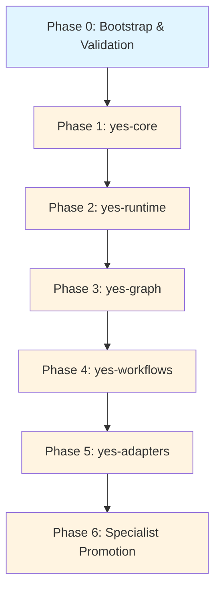

# Yes-human: Phased Development & Architecture Plan

**Last Updated:** 2026-05-29  
**Status:** Pre-development planning complete, ready for Wave 0 implementation  
**Companion Documents:**
- `YES-HUMAN_REVIEW_AND_AGENT_CREATION_PLAN.md` — Review findings and agent creation strategy
- `YES-HUMAN_SOURCE_MAP.md` — Validated source registry for agent/workflow creation
- `reports/ECC-SKILL-SOURCE-MAP-DEEP-RESEARCH.md` — 180+ repos mapped across 8 ECC skill categories

---

## Executive Summary

This document maps out the architecture and phased engineering roadmap to build the complete, production-grade `yes-human` portable control plane. The plan integrates findings from deep research into 180+ open-source repositories implementing agent harness systems, MCP servers, multi-agent orchestration, coding/TDD/security agents, and research/content/business workflows.

**Key Integration:** The ECC (Everything Claude Code) source map research identified critical architecture patterns, reusable components, and selective absorption targets that will accelerate yes-human development while maintaining the low-token, lazy-loaded philosophy.



---

## Architecture Overview

`yes-human` separates the agentic system into logical packages in a Node.js monorepo:

1. **`yes-core`**: Policy evaluation, validation rules, quality gates, and token budget limits.
2. **`yes-runtime`**: Spawns specialist subprocesses, intercepts tool execution, and creates execution traces.
3. **`yes-graph`**: Pre-route filters, Phrase Trie matching, SQLite index queries, and semantic fallback matching.
4. **`yes-adapters`**: Host adaptation layers (CLI, MCP, Claude, Cursor, Codex, Windsurf, etc.) using signed capability manifests.

### ECC Source Map Integration Strategy

Based on deep research into 180+ repositories, yes-human will selectively absorb patterns from:

- **Agent Harness Systems** (34 repos): ECC, agency-agents, karpathy-skills, agent-skills
- **MCP Servers** (38 repos): Official MCP servers, awesome-mcp-servers, platform-specific implementations
- **Multi-Agent Orchestration** (36 repos): LangGraph, CrewAI, AutoGen, open-multi-agent
- **Coding/TDD/Security** (35 repos): PR-Agent, Strix, moai-adk, agent-audit
- **Research/Content/Business** (61 repos): gpt-researcher, DeepResearch, CompetitorScope

**Absorption Principle:** Extract patterns and architecture decisions, not wholesale code imports. Every absorbed pattern must pass source dossier validation and license compatibility checks.

---

## Phased Roadmap

### Phase 0: Bootstrap & Validation (Current State)
**Objective**: Ensure all planning artifacts, source maps, and validation infrastructure are complete and consistent before starting runtime development.

**Status**: ✅ Complete
- [x] Architecture document (`yes-human-agentic-system-architecture.md`)
- [x] Development plan (this document)
- [x] Review and agent creation plan
- [x] Source map with validated URLs
- [x] ECC deep research report (180+ repos across 8 categories)
- [x] Registry file structure
- [x] Folder structure aligned with architecture
- [x] Validation scripts (`validate.js`, `eval-cost.js`)
- [x] OpenCode MCP configuration (firecrawl, exa, github, context7, memory, playwright, sequential-thinking)

**Exit Criteria**:
- All planning documents cross-reference each other correctly
- Source map URLs validated (HTTP 200 or documented redirects)
- ECC research findings integrated into wave planning
- No duplicate content across planning documents
- Registry schemas defined and validated
- Folder structure matches canonical layout in architecture doc

---

### Phase 1: Core Decisions & Policy Layer (`yes-core`)
**Objective**: Build a host-agnostic module for loading schemas, verifying agent states, and asserting context/token budget allocations.

**ECC Source Map Integration**:
- Absorb validation patterns from `addyosmani/agent-skills` (anti-rationalization tables, verification gates)
- Reference `stevesolun/ctx` quality scoring (4-signal model) for skill/workflow validation
- Adopt `RealZST/HarnessKit` trust scoring approach (18 static analysis rules, 0-100 scores)
- Use `NVIDIA/SkillSpector` vulnerability patterns (64 patterns across 16 categories) for skill security scanning

**Competitor Pattern Integration** (from `reports/COMPETITOR-ANALYSIS.md`):
- **Pattern #4: Loop prevention** (AgentMaster) — Max depth=2, no self-invocation, no circular calls in router
- **Pattern #5: Doctor command** (nexus-agents + agent-harness) — Health check for Node version, API keys, configured tools, route table validity

* **Folder Skeleton**: `packages/yes-core/`
  * `package.json` - Module definition.
  * `index.js` - Exports PolicyEvaluator and SchemaLoader.
  * `lib/policy.js` - Implements token boundary checks, quality threshold assertions, and high-stakes disclaimer gates.
  * `lib/validator.js` - Schema validation with ECC-inspired quality gates.
  * `lib/trust-scorer.js` - Trust scoring for absorbed skills/agents (0-100 scale).
  * `lib/router-safety.js` - Loop prevention: max depth, no self-invocation, no circular calls.
  * `lib/doctor.js` - Health check: Node version, API keys, tools, route table validity.
* **Key Contracts**:
  * `evaluatePolicy(agentId, prompt, contextSize)` returns `{ allowed: boolean, budgetBand: string, reason: string }`
  * `validateSkill(skillPath)` returns `{ valid: boolean, score: number, issues: string[] }`
  * `calculateTrustScore(artifact)` returns `{ score: number, flags: string[], recommendation: string }`
  * `checkLoopSafety(routeChain)` returns `{ safe: boolean, violation: string | null }`
  * `runDoctorCheck()` returns `{ healthy: boolean, issues: string[], suggestions: string[] }`
* **Verification Checkpoints**:
  * Unit tests enforcing that queries exceeding budget bands are blocked.
  * Checks asserting disclaimer dispatches for legal, compliance, and security domains.
  * Trust scoring correctly flags unlicensed or low-quality absorbed content.
  * Loop prevention blocks circular routing chains and excessive depth.
  * Doctor command identifies missing dependencies and invalid route table entries.

---

### Phase 2: Execution & Spawner Runtime (`yes-runtime`)
**Objective**: Build the process lifecycle engine that execute tools in sandboxed workspaces, routes outputs, and collects outcome traces.

**ECC Source Map Integration**:
- Adopt `open-multi-agent/open-multi-agent` goal-first DAG decomposition pattern (TypeScript, 3 deps)
- Reference `alialaayedi/forgent` PlanCard pattern (structured plan output with steps, gotchas, success criteria)
- Use `lastmile-ai/mcp-agent` composable workflow patterns (Router → Orchestrator → Evaluator-Optimizer)
- Implement `forgent` outcome feedback loop (`report_outcome` → next plan surfaces gotchas) for Agent Lightning-style learning

**Competitor Pattern Integration** (from `reports/COMPETITOR-ANALYSIS.md`):
- **Pattern #9: Outcome tracking** (nexus-agents) — Record success/fail per route in `graph/memory/episodic/outcomes.jsonl` for routing feedback
- **Pattern #13: Token compression output layer** (AgentMaster) — Optional caveman-style output hook (~75% token savings)
- **Pattern #17: Fan-out parallel dispatch** (iso) — Parallel agent dispatch with result aggregation for complex tasks

**Research Tool Strategy** (built-in capability):
- **Tier 1 (Preferred)**: firecrawl/exa MCPs when API keys available (structured results, best coverage)
- **Tier 2 (Free fallback)**: webfetch, playwright, gh api, curl/wget (always available, no API keys needed)
- **Decision tree**: Small lookup → webfetch directly; Deep research → firecrawl/exa if available, else fallback stack
- **Top 10 tools ranked**: See `~/.agents/skills/deep-research/SKILL.md` for full tool selection matrix
- **Implementation**: `yes-runtime` tool router auto-detects available MCPs and falls back to free tools

* **Folder Skeleton**: `packages/yes-runtime/`
  * `index.js` - Exports RuntimeEngine and ContextSpawner.
  * `lib/spawner.js` - Spawns subprocesses or MCP connections securely.
  * `lib/tools.js` - Tool execution safety interceptors.
  * `lib/tracer.js` - Saves execution trace results to `registry/provenance.json`.
  * `lib/planner.js` - PlanCard generation with steps, gotchas, success criteria (forgent pattern).
  * `lib/dag.js` - Goal-first task DAG decomposition (open-multi-agent pattern).
  * `lib/outcome-tracker.js` - Records success/fail per route for routing feedback loop.
  * `lib/compressor.js` - Optional output-layer token compression (caveman pattern).
  * `lib/fanout.js` - Parallel agent dispatch with result aggregation.
* **Key Contracts**:
  * `spawnAgent(agentConfig, inputs)` returns `Promise<AgentOutcome>`
  * `executeTool(toolName, args)` returns `Promise<ToolResult>`
  * `generatePlanCard(task, route)` returns `{ steps: [], gotchas: [], successCriteria: [], memoryIndex: string }`
  * `reportOutcome(traceId, outcome)` updates mistake graph for future routing
  * `trackOutcome(routeId, success: boolean, metadata)` appends to outcomes.jsonl
  * `compressOutput(content, level)` returns compressed content with token savings estimate
  * `fanoutDispatch(agents[], inputs)` returns aggregated results from parallel execution
* **Verification Checkpoints**:
  * Verification that subagents are spawned with specific environment variables and command arrays (no raw shell executions).
  * Checking that outcomes write structured audit records to the provenance registry.
  * PlanCard generation produces valid structured output for all route types.
  * Outcome feedback loop correctly updates mistake graph edges.
  * Outcome tracker correctly appends to outcomes.jsonl with route metadata.
  * Token compression achieves 50-75% savings without losing critical information.
  * Fan-out dispatch correctly aggregates results from parallel agents and handles failures.

---

### Phase 3: Multi-Tiered Index & Phrase Trie (`yes-graph`)
**Objective**: Establish the high-performance search and routing indexing layers (Level 0 to Level 2) that enable zero-config routing.

**ECC Source Map Integration**:
- Adopt `stevesolun/ctx` graph-based recommendation approach (102K-node / 2.9M-edge knowledge graph)
- Implement `ctx` 4-signal quality scoring for skills (quality, health, drift, usage)
- Reference `ctx` micro-skill gate pattern (convert long skill bodies to compact form for token budget)
- Use `revfactory/harness` 6 team-architecture topologies as route table "topology" hints (Pipeline, Fan-out, Expert Pool, Producer-Reviewer, Supervisor, Hierarchical)

**Competitor Pattern Integration** (from `reports/COMPETITOR-ANALYSIS.md`):
- **Pattern #1: Progressive skill disclosure** (agentic-harness) — Tiny manifest always loaded, full content on trigger match (validates yes-human's core thesis)
- **Pattern #2: Signal-word routing table** (AgentMaster) — Add `signalWords` and `tiebreakers` fields to route table entries
- **Pattern #6: 4-layer memory model** (agentic-harness) — working/episodic/semantic/personal with distinct retention policies
- **Pattern #8: Drift detection** (nexus-agents) — `yes validate --drift` checks ROUTE_TABLE vs registry consistency
- **Pattern #10: Schema versioning + migration** (agent-harness) — `yes migrate` for graph indexes and route tables
- **Pattern #18: Skill failure tracking** (agentic-harness) — 3+ failures in 14 days → rewrite flag in graph health

* **Folder Skeleton**: `packages/yes-graph/`
  * `package.json` - Module definition.
  * `index.js` - Exports RouteGraph and TrieRouter.
  * `lib/trie.js` - High-performance phrase matching tree.
  * `lib/db.js` - SQLite indexing layer (warm search indices).
  * `lib/quality-scorer.js` - 4-signal quality scoring for skills/agents (ctx pattern).
  * `lib/topology.js` - 6 team-architecture topology hints for workflow selection (harness pattern).
  * `lib/micro-skill-gate.js` - Token budget enforcement via skill compaction.
  * `lib/memory/` - 4-layer memory model (working, episodic, semantic, personal).
  * `lib/drift-detector.js` - Validates ROUTE_TABLE entries match actual registry agents.
  * `lib/migrator.js` - Schema versioning and migration for graph indexes.
  * `lib/health-tracker.js` - Skill failure tracking (3+ failures in 14 days → rewrite flag).
* **Key Contracts**:
  * `insertRoute(keyword, routeId)`
  * `matchRoute(prompt)` returns the route id sorted by exact match first, then longest matching phrase.
  * `scoreQuality(artifactId)` returns `{ quality: number, health: number, drift: number, usage: number }`
  * `getTopologyHint(routeId)` returns `{ pattern: string, fanout: number, coordination: string }`
  * `compactSkill(skillId, tokenBudget)` returns compacted skill content within budget
  * `loadMemory(layer, key)` returns memory content with retention policy applied
  * `detectDrift()` returns `{ drifted: boolean, mismatches: string[] }`
  * `migrateSchema(fromVersion, toVersion)` applies migrations with backup
  * `trackSkillFailure(skillId, failureType)` updates health metrics and flags rewrite candidates
* **Verification Checkpoints**:
  * Asserting that a prompt containing multiple triggers correctly matches the most specific (longest) keyword.
  * SQLite database migrations compile and run correctly.
  * Quality scoring correctly identifies stale or low-quality skills.
  * Topology hints correctly suggest coordination patterns for multi-agent workflows.
  * Micro-skill gate enforces token budget without losing critical information.
  * Progressive disclosure loads only manifest at startup, full content on match.
  * Signal-word routing with tiebreakers resolves ambiguous categories correctly.
  * 4-layer memory model correctly applies retention policies (working=volatile, episodic=scored, semantic=distilled, personal=isolated).
  * Drift detection identifies mismatches between ROUTE_TABLE and registry.
  * Schema migration preserves data integrity across version upgrades.
  * Skill failure tracking correctly flags rewrite candidates after threshold.

---

### Phase 4: Multi-Agent Workflows & Orchestrator (`yes-workflows`)
**Objective**: Implement the orchestration workflow layer to chain agents, handle step gates, and recover from failures.

**ECC Source Map Integration**:
- Adopt `lastmile-ai/mcp-agent` composable workflow patterns (Router, Orchestrator, Evaluator-Optimizer, Map-Reduce, Swarm)
- Reference `open-multi-agent` auto-scheduling strategies (dependency-first, round-robin, least-busy, capability-match)
- Use `Tanush1912/ouroboros` state machine pattern (Planner → Implementer → Validator → Reviewer → Cleaner → Post-Mortem)
- Implement `PietroPasotti/orc` YAML kanban board approach (plan → code → review → merge)
- Reference `modu-ai/moai-adk` TDD quality gates (24 agents + 52 skills with 10-gate dev cycles)

**Competitor Pattern Integration** (from `reports/COMPETITOR-ANALYSIS.md`):
- **Pattern #11: Nightly staging cycle** (agentic-harness) — Automated pattern extraction from episodic memory via cron or `yes dream`
- **Pattern #12: Plan/apply pipeline** (agent-harness) — Deterministic operations with collision detection (`yes plan` + `yes apply`)
- **Pattern #14: Contract/ledger primitives** (iso) — Formal agent behavior contracts + immutable audit trail

* **Folder Skeleton**: `packages/yes-workflows/`
  * `package.json` - Module definition.
  * `index.js` - Exports WorkflowOrchestrator.
  * `lib/orchestrator.js` - Parallel/sequential agent executors.
  * `lib/rollback.js` - Rollback procedure caller.
  * `lib/patterns.js` - Composable workflow patterns (mcp-agent patterns).
  * `lib/scheduler.js` - Auto-scheduling strategies (open-multi-agent patterns).
  * `lib/state-machine.js` - Workflow state machine (ouroboros pattern).
  * `lib/dream-cycle.js` - Nightly pattern extraction from episodic memory (auto_dream).
  * `lib/plan-apply.js` - Deterministic plan/apply pipeline with collision detection.
  * `lib/contract.js` - Formal agent behavior contracts with verification.
  * `lib/ledger.js` - Immutable audit trail for workflow executions.
* **Key Contracts**:
  * `runWorkflow(workflowId, inputs)` returns `Promise<WorkflowResult>`
  * `composePatterns(...patterns)` returns composite workflow definition
  * `scheduleTasks(taskDAG, strategy)` returns execution order
  * `transitionState(workflowId, event)` returns new state with guards
  * `runDreamCycle()` extracts patterns from episodic memory and stages candidates
  * `planChanges(config)` returns `{ operations: [], collisions: [], warnings: [] }`
  * `applyChanges(plan)` executes deterministic operations with rollback on failure
  * `verifyContract(agentId, contract)` returns `{ valid: boolean, violations: string[] }`
  * `appendLedger(entry)` appends to immutable audit trail with hash chain
* **Verification Checkpoints**:
  * Run mock workflows with sequential steps and assert outcome validations.
  * Trigger failure hooks and verify rollback procedures clean up workspace artifacts.
  * Composable patterns correctly chain Router → Orchestrator → Evaluator-Optimizer.
  * Auto-scheduling correctly parallelizes independent tasks.
  * State machine correctly enforces gates between workflow phases.
  * Dream cycle correctly clusters patterns and stages candidates without AI reasoning.
  * Plan/apply pipeline detects collisions and executes operations deterministically.
  * Contract verification catches agent behavior violations before execution.
  * Ledger maintains hash chain integrity across workflow executions.

---

### Phase 5: Platform Adapters & Exporters (`yes-adapters`)
**Objective**: Build and compile host bundles (Claude Code, MCP, CLI, Cursor, Generic stdio capability manifests) to adapt Yes-human to developer environments.

**ECC Source Map Integration**:
- Reference `RealZST/HarnessKit` cross-agent format normalization (manages 5 extension types across 8 agents)
- Adopt `ndizazzo/saddle` cross-agent config sync approach (keeps agents, skills, commands in sync across Claude Code, Codex, Copilot, Cursor, Gemini, OpenCode)
- Use `mcpware/cross-code-organizer` dashboard approach for cross-harness config management
- Reference ECC's own `.opencode/opencode.json`, `.mcp.json`, `.agents/` structure as canonical multi-harness output

**Competitor Pattern Integration** (from `reports/COMPETITOR-ANALYSIS.md`):
- **Pattern #15: Preset system** (agent-harness) — `yes preset apply starter` for quick workspace bootstrapping from templates
- **Pattern #16: U-Haul migration** (agent-harness) — `yes import` converts existing `.claude/`, `.cursor/`, `AGENTS.md` into yes-human format
- **Pattern #19: Override sidecars** (agent-harness) — `agent.overrides.<provider>.yaml` for per-provider customization
- **Pattern #20: Codebase snapshots** (AgentMaster) — Graph index building pipeline for whole-repo context (repomix pattern)

* **Folder Skeleton**: `packages/yes-adapters/`
  * `package.json` - Module definition.
  * `index.js` - Exports AdapterFactory.
  * `lib/cli.js` - CLI adapter mapping commands to runtimes.
  * `lib/stdio.js` - Standard JSON-over-stdio protocol handler with cryptographic manifests.
  * `lib/normalizer.js` - Cross-agent format normalization (HarnessKit pattern).
  * `lib/sync.js` - Cross-agent config sync (saddle pattern).
  * `lib/preset.js` - Preset system for quick workspace bootstrapping.
  * `lib/importer.js` - U-Haul migration from legacy provider configs.
  * `lib/override.js` - Per-provider override sidecars.
  * `lib/snapshot.js` - Codebase snapshot generation for graph indexing.
  * `adapters/claude.js` - Claude Code adapter (plugin.json, CLAUDE.md, commands, hooks)
  * `adapters/codex.js` - Codex adapter (AGENTS.md, skills, mcp-config)
  * `adapters/opencode.js` - OpenCode adapter (opencode.json, AGENTS.md, MCP config)
  * `adapters/cursor.js` - Cursor adapter (.cursorrules, .cursor/rules)
  * `adapters/windsurf.js` - Windsurf adapter (.windsurfrules, cascade flows)
  * `adapters/generic.js` - Generic adapter (stdio/HTTP/file-drop protocol)
* **Key Contracts**:
  * Stdio communication protocol: `{ jsonrpc: "2.0", method: string, params: object, id: number }`
  * `normalizeForHost(artifact, hostId)` returns host-specific format
  * `syncConfig(source, targets[])` propagates changes across agent configs
  * `generateBundle(hostId)` returns complete host-specific output
  * `applyPreset(presetName)` bootstraps workspace from template
  * `importLegacy(providerPath)` converts existing configs to yes-human format
  * `loadOverride(agentId, provider)` returns provider-specific customizations
  * `generateSnapshot(repoPath)` creates codebase snapshot for graph indexing
* **Verification Checkpoints**:
  * Testing stdio message exchanges with mock editor plugins.
  * Verifying CLI commands (`yes route`, `yes run`) exit with standard codes.
  * Cross-agent normalization produces valid output for each host.
  * Config sync correctly propagates changes without breaking host-specific formats.
  * Generated bundles pass host-bundle validator for each target platform.
  * Preset system correctly bootstraps workspace with all required files.
  * U-Haul migration preserves existing config semantics while converting format.
  * Override sidecars correctly merge with base agent definitions.
  * Codebase snapshot captures repo structure for graph indexing without excessive token cost.

---

### Phase 6: Specialist Agent Expansion & Promotion
**Objective**: Mine references (ECC, Claude Code, bug hunters, etc.) to catalog and promote 250-450 specialist agents across the 12 master domains.

**ECC Source Map Integration** (by category):

**Engineering Agents** (from 35 coding/TDD/security repos):
- `code-reviewer`: Absorb patterns from `The-PR-Agent/pr-agent` (11.4K stars), `spencermarx/open-code-review` (multi-agent debate)
- `tdd-guide`: Absorb from `modu-ai/moai-adk` (24 agents + 52 skills), `LerianStudio/ring` (89 skills + 38 agents, 10-gate cycles)
- `security-reviewer`: Absorb from `usestrix/strix` (25.7K stars), `anthropics/claude-code-security-review` (4.9K stars), `HeadyZhang/agent-audit` (OWASP Agentic Top 10)
- `build-error-resolver`: Reference `LerianStudio/ring` systematic debugging patterns

**Research Agents** (from 14 deep research repos):
- `deep-research-agent`: Absorb from `assafelovic/gpt-researcher` (20K stars), `langchain-ai/open_deep_research` (10K stars)
- `market-research-agent`: Absorb from `maomaozhe/CompetitorScope` (5-agent LangGraph pipeline), `npow/deeprecon` (competitive intelligence + market mapping)

**Content Agents** (from 10 content creation repos):
- `article-writer`: Absorb from `npow/ghostwriter` (anti-slop quality gates, style fingerprinting)
- `brand-voice-agent`: Absorb from `Reese-Pallath/Brand-Voice-Architect` (semantic cartography, neural tone analysis)

**Business Agents** (from 21 investor/business repos):
- `investor-materials-agent`: Absorb from `vinicius91carvalho/founder-os` (12 skills + orchestrator, YC/Sequoia frameworks)
- `competitive-intel-agent`: Absorb from `Ambitus-Intelligence/ambitus-ai-models` (8 specialized market research agents)

* **Dossier Requirement**: No specialist agent enters staging/production without a source dossier containing a verified license match, maintenance score, and quality gate assertion.
* **Promotion Pipeline**:
  ```text
  Draft Agent -> Staging Promotion (Dossier + Route test) -> Production Gate (Review + Verification)
  ```
* **Quality Gates** (per agent):
  * Source dossier score `>= 80` (using 4-signal quality model from Phase 3)
  * No blocker license/provenance findings
  * Route fixtures pass (at least 5 trigger phrases correctly route)
  * Cost budget passes (agent context pack within budget band)
  * Failure modes and verification steps exist
  * Not a duplicate of a better existing agent
  * Anti-rationalization table included (from `addyosmani/agent-skills` pattern)

---

## ECC Source Map: Architecture Pattern Summary

The deep research into 180+ repositories identified 14 critical architecture patterns that yes-human should selectively absorb:

| Pattern | Source Repo | yes-human Application |
|---------|------------|----------------------|
| **PlanCard** | `alialaayedi/forgent` | Structured route output with steps, gotchas, success criteria |
| **Goal-first DAG** | `open-multi-agent/open-multi-agent` | Runtime router with pre-indexed route tables |
| **6 Team Topologies** | `revfactory/harness` | Route table "topology" hints (Pipeline, Fan-out, Expert Pool, Producer-Reviewer, Supervisor, Hierarchical) |
| **Anti-Rationalization Tables** | `addyosmani/agent-skills` | Skill contracts with common agent excuses + rebuttals |
| **Progressive Disclosure** | ECC, `addyosmani/agent-skills` | SKILL.md entry → lazy-load references on demand |
| **Outcome Feedback Loop** | `alialaayedi/forgent` | `report_outcome` → next plan surfaces gotchas (Agent Lightning-style learning) |
| **Pull-based Memory** | `alialaayedi/forgent` | Virtual paths, not dumped blobs (low-token memory) |
| **Graph-based Routing** | `stevesolun/ctx` | 102K-node knowledge graph for recommendation (yes-graph DSA-style indexes) |
| **4-Signal Quality Scoring** | `stevesolun/ctx` | Skill/workflow registry validation (quality, health, drift, usage) |
| **Trust Scoring & Audit** | `RealZST/HarnessKit` | 18 static analysis rules, 0-100 trust scores for absorbed content |
| **Composable MCP Patterns** | `lastmile-ai/mcp-agent` | Router → Orchestrator → Evaluator-Optimizer chain |
| **Self-Evolving Subagents** | `zzatpku/AgentFactory`, `alialaayedi/forgent` | Meta-Agent creates/refines subagents as code modules |
| **Verification Gates** | `LearnPrompt/cc-harness-skills` | Read-only challenge pass after implementation |
| **Micro-skill Gate** | `stevesolun/ctx` | Convert long skill bodies to compact form for token budget |

**License Compatibility**: All 14 patterns come from MIT or Apache-2.0 licensed repositories, fully compatible with yes-human's MIT license. Apache-2.0 sources require notice preservation.

---

## Pre-Development Checklist

Before starting Phase 1 implementation, verify:

### Planning Artifacts
- [x] Architecture document complete (`yes-human-agentic-system-architecture.md`)
- [x] Development plan with ECC integration (this document)
- [x] Review and agent creation plan (`YES-HUMAN_REVIEW_AND_AGENT_CREATION_PLAN.md`)
- [x] Source map with validated URLs (`YES-HUMAN_SOURCE_MAP.md`)
- [x] ECC deep research report (`reports/ECC-SKILL-SOURCE-MAP-DEEP-RESEARCH.md`)
- [x] All documents cross-reference each other correctly
- [x] No duplicate content across planning documents

### Infrastructure
- [x] Registry file structure created (17 JSON files in `registry/`)
- [x] Folder structure matches canonical layout (packages/, content/, graph/, references/, staging/, reports/)
- [x] Validation scripts exist (`packages/yes-schema/validate.js`, `packages/yes-schema/eval-cost.js`)
- [x] OpenCode MCP configuration complete (7 MCP servers: firecrawl, exa, github, context7, memory, playwright, sequential-thinking)
- [x] `.gitignore` configured correctly

### Source Map Validation
- [x] All URLs in `YES-HUMAN_SOURCE_MAP.md` validated (HTTP 200 or documented redirects)
- [x] ECC research findings categorized across 8 skill categories
- [x] 180+ repos mapped with license compatibility noted
- [x] 14 critical architecture patterns identified for absorption
- [x] Selective absorption targets prioritized (not bulk imports)

### Readiness for Phase 1
- [ ] `packages/yes-core/` folder skeleton created
- [ ] Schema definitions drafted (agent, skill, workflow, route, source-reference)
- [ ] Policy evaluator interface designed
- [ ] Trust scoring algorithm specified
- [ ] Unit test framework configured
- [ ] First hand-authored source dossier created as template

---

## Next Steps

1. **Immediate**: Create `packages/yes-core/` folder skeleton and schema definitions
2. **Week 1**: Implement policy evaluator, validator, and trust scorer
3. **Week 2**: Create first hand-authored source dossier for `engineering.code-reviewer`
4. **Week 3**: Implement `yes route` command with small exact route table
5. **Week 4**: Implement `yes eval cost` and verify startup token budget

**Success Criteria for Phase 1**:
- Schema validation works for agents, skills, workflows, routes
- Policy evaluator correctly blocks queries exceeding budget bands
- Trust scoring correctly flags unlicensed or low-quality content
- First source dossier passes all validation gates
- `yes route` correctly matches exact keywords to route IDs
- `yes eval cost` verifies startup stays under 180 tokens

---

## Appendix: ECC Source Map Statistics

**Total Repos Researched**: 180+  
**Categories Covered**: 8 (Agent Harness, MCP Servers, Multi-Agent Orchestration, Coding/TDD/Security, Research, Content, Business, Agent Management)  
**Deep-Read Repos**: 7 (revfactory/harness, open-multi-agent, forgent, ctx, agent-skills, HarnessKit, mcp-agent)  
**MIT-Compatible**: 100% of critical patterns  
**Total Stars of Top 10 Repos**: ~260,000+  
**Ecosystem Size**: Estimated 7,000+ MCP servers exist as of mid-2026

**Key Insight**: yes-human's low-token, lazy-loaded routing approach is validated by multiple independent implementations (open-multi-agent, agent-router, forgent). The architecture is sound; execution discipline is the main risk.
