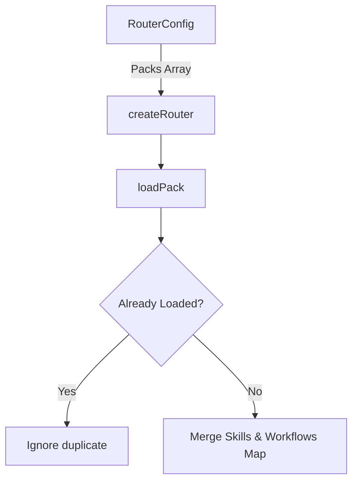
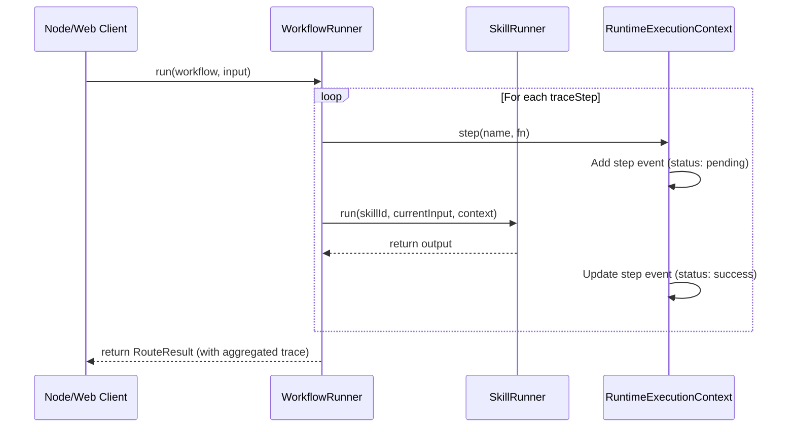

# Architecture of yes-human

`yes-human` is a lightweight, low-token AI workflow router and control plane designed to run locally, offline-first. It handles routing, workflows, instructions, and pack management around LLM systems (such as Codex, Antigravity, or Cursor).

---

## Product Positioning

Instead of passing massive, generic instructions directly to an LLM context on every prompt (leading to high token costs and latency), `yes-human` intercepts the user query locally, determines the precise intent, and returns a tailored agent dossier, workflow, and instructions.

* **What it is**: The routing, workflow orchestration, instruction-scaffolding, and security validation layer.
* **What it is NOT**: An LLM, database, or a direct replacement for coding tools.

---

## Package Responsibility Map

`yes-human` is organized as a monorepo containing decoupled packages:

| Package | Responsibility |
|---|---|
| [`@yes-human/core`](file:///Users/moramvenkatasatyajaswanth/yes-human/packages/yes-core) | Fast, browser-safe routing primitives, pack load handlers, and type registries. |
| [`@yes-human/runtime`](file:///Users/moramvenkatasatyajaswanth/yes-human/packages/yes-runtime) | Workflow and step runners, context propagation, and learning-engine integration. |
| [`@yes-human/packs`](file:///Users/moramvenkatasatyajaswanth/yes-human/packages/yes-packs) | Standardized, domain-specific bundles of workflows and skill metadata. |
| [`@yes-human/adapters`](file:///Users/moramvenkatasatyajaswanth/yes-human/packages/yes-adapters) | Exporters to translate local configurations to Codex and Antigravity. |
| [`@yes-human/doc-tools`](file:///Users/moramvenkatasatyajaswanth/yes-human/packages/yes-doc-tools) | Optional document-to-markdown converters (requires Python & Microsoft MarkItDown). |
| [`yes-cli`](file:///Users/moramvenkatasatyajaswanth/yes-human/packages/yes-cli) | SDK command line tool to validate setups, route queries, and trigger builds. |

---

## System Workflows & Pipelines

### 1. Pack Loading Flow
Packs are loaded into the core router at initialization. Workflows and skills are compiled into indexing structures.



### 2. Query Routing Flow
When a user query is received, the router goes through a deterministic routing pipeline:

```mermaid
graph TD
  Query[User Input] --> N[Normalize Query]
  N --> Scope{Is Pack Scoped? e.g. '[developer]'}
  Scope -->|Yes| Filter[Filter Workflows by Pack]
  Scope -->|No| All[Check All Workflows]
  Filter --> E1[1. Exact Phrase Match]
  All --> E1
  E1 -->|Match| Resolve[Resolve Workflow]
  E1 -->|No Match| E2[2. Alias / Containment Match]
  E2 -->|Match| Resolve
  E2 -->|No Match| E3[3. Keyword Token Overlap]
  E3 -->|Match| Resolve
  E3 -->|No Match| E4[4. Semantic Router Hook]
  E4 -->|Match| Resolve
  E4 -->|No Match| Fallback[Fallback: Supreme Router]
```

### 3. Trace and Execution Pipeline
When a workflow is resolved or directly executed, the step trace logs performance:



---

## Offline-First Design

1. **Instant Resolution**: 99% of query routing is handled by local string normalization and regex/phrase-trie lookups. Average resolution latency is under **0.05ms**, running with zero network dependency.
2. **Redaction & Filtering**: Input validation rules (e.g. licensing constraints or secret checks) are run in local hooks inside the memory sandbox.
3. **Low-Token Control Plane**: Keeps the runtime context clean by loading only the active workflows, preserving valuable LLM context space.
