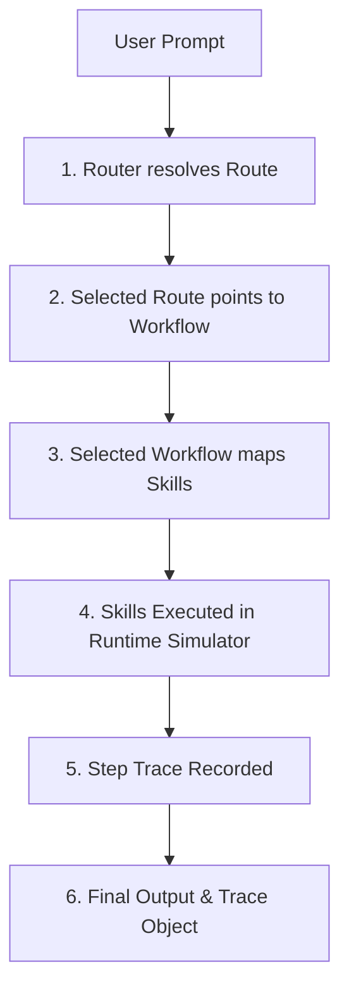

# Architecture Guide

This document describes the routing, execution, and trace tracking architecture of the `yes-human` SDK.

## Execution Flow

The main objective of `yes-human` is to turn a natural-language user task into a structured execution trace while loading only the minimum instructions required.

1. **User Prompt**: The user inputs a task description (e.g. *"review my code for bugs"*).
2. **Router Resolution**: The router evaluates the prompt against registered trigger phrases, aliases, and keywords to select a specific route.
3. **Workflow Selected**: The route identifies a target workflow containing sequential execution steps.
4. **Skill Execution**: The runtime loads the specific skill files required for the workflow.
5. **Trace Tracking**: Every action, skill invocation, and state transition is captured by the trace tracker.
6. **Final Output**: The SDK returns the final resolution metadata and a strict execution trace.

---

## Deterministic Offline Routing Engine

The core routing engine operates completely offline without calling remote API endpoints. It evaluates matches through the following sequence:

### 1. Exact Phrase Match
Checks if the normalized prompt matches any route's primary trigger phrase exactly. This is the fastest match stage with $1.0$ confidence.

### 2. Alias Match
Checks if the normalized prompt matches any defined route aliases (e.g., shorthand names or common synonyms). Resolves with $0.95$ confidence.

### 3. Keyword / Phrase Containment
Uses phrase-trie parsing to find if any registered keyword sequences are contained within the user's prompt (longest containment match wins). Resolves with $0.9$ confidence.

### 4. Pack-Scoped Filtering
When a router is instantiated with specific packs, it scopes routing decisions to routes defined within those packs, preventing namespace collisions and reducing the lookup space.

### 5. Fallback Route
If no stages produce a match, the engine routes the prompt to the fallback route (e.g., `route.meta-system.supreme-router`).

---

## Performance & Budgets

* **Zero Latency Overhead**: Deterministic matching avoids slow network requests or model inference. Normal routing decisions take `<1ms`.
* **Zero Token Waste**: By loading only the selected agent dossier and skill definitions rather than all instructions, the startup context remains small and compliant with tight agent context budgets.
