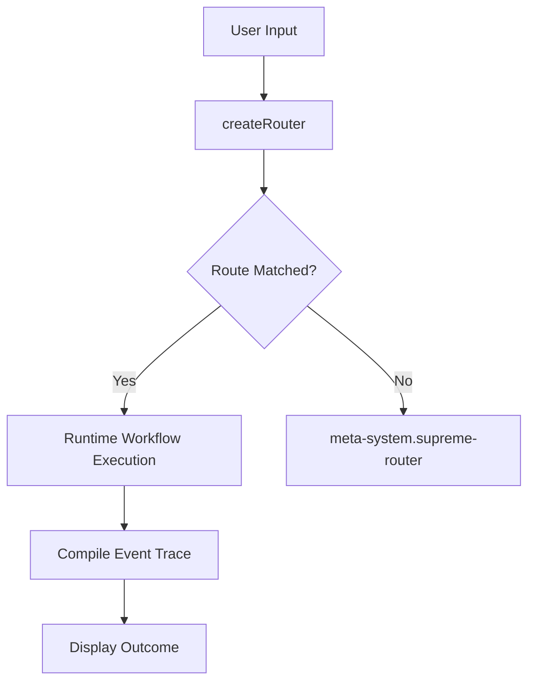

# Integration Guide

This guide details how to integrate the yes-human routing SDK into offline-first desktop apps (Electron, Tauri) or agent frameworks.

## Integration Flow Diagram



## Tauri / Electron Integration

Since the core router doesn't import Node-specific APIs (`fs`, `path`) at its entry points, it is safe to package in client-side React apps that run inside Tauri or Electron windows:

```typescript
import { createRouter } from "@yes-human/core";
import { defaultPack } from "@yes-human/packs";

// Safely executable on client renderer threads
const router = createRouter({ packs: [defaultPack] });
const result = await router.route("my task query");
```
