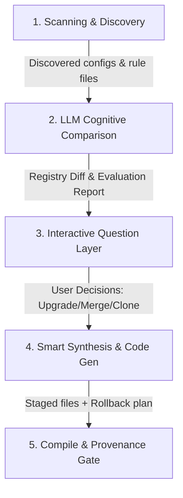

# Future Features & Proposals

This document outlines the roadmap, improvement opportunities, and detailed feature proposals for `yes-human`.

---

## Part 1: Feature Roadmap

A summary of planned maintenance, code quality, and performance enhancements.

### 1. CLI Modularization [Completed]

**Current state:** The CLI entry point (`packages/yes-cli/index.js`) is a single 59KB file handling all subcommands (route, build, eval, absorb, doctor, contribute, etc.).

**Improvement:** Split into per-command modules under `packages/yes-cli/commands/` for easier maintenance, faster load times, and contributor-friendliness.

```
packages/yes-cli/
├── index.js          ← thin dispatcher
├── commands/
│   ├── route.js
│   ├── build.js
│   ├── eval.js
│   ├── absorb.js
│   ├── doctor.js
│   ├── contribute.js
│   ├── feedback.js
│   ├── workflow.js
│   ├── team.js
│   ├── offline.js
│   └── recover.js
```

**Priority:** Medium — improves DX but doesn't affect functionality.

---

### 2. Deeper Domain-Specific Agent Dossiers

**Current state:** 325 agents follow a consistent 3-phase template (Context → Planning → Implementation). This gives excellent uniformity but some specialist agents could benefit from domain-specific procedure steps.

**Improvement:** Enrich high-value agents with domain-tailored procedures. For example:
- **Healthcare agents** → add clinical-evidence-grading steps, citation-checking procedures
- **Finance agents** → add regulatory-compliance checklists, audit-trail verification
- **Security agents** → add threat-model decomposition steps, CVE cross-reference checks
- **Legal agents** → add jurisdiction-awareness, precedent-matching procedures

**Priority:** High — directly improves output quality for specialist domains.

---

### 3. TypeScript Migration (Optional)

**Current state:** Pure JavaScript throughout. Works fine and keeps the dependency footprint minimal.

**Improvement:** Gradual TypeScript adoption for core packages (`yes-core`, `yes-runtime`, `yes-graph`) to improve:
- IDE autocomplete and refactoring support
- Type-safe registry access
- Better contributor onboarding (types serve as documentation)

**Priority:** Low — the codebase works well as-is; TypeScript is a convenience, not a necessity.

---

### 4. Package-Level Documentation [Completed]

**Current state:** Top-level documentation (README, CONTRIBUTING, SECURITY, VERSIONING) is strong. Individual packages under `packages/` lack their own READMEs.

**Improvement:** Add a `README.md` to each package explaining:
- What the package does
- Public API surface
- Key files and their roles
- Usage examples

**Priority:** Medium — helps contributors navigate the monorepo.

---

### 5. Architecture Diagram

**Current state:** The architecture is described in text across the README and code comments.

**Improvement:** Add a Mermaid diagram to the README showing:
- The 7-stage routing pipeline flow
- Package dependency graph
- Hook lifecycle (pre-route → route → post-route)
- Boot → route → lazy-load → execute flow

**Priority:** Low — nice-to-have for onboarding.

---

### 6. Snapshot Testing for Host Bundles [Completed]

**Current state:** Host bundles are built and validated structurally by `host-bundle.validator.js`, but there's no snapshot comparison to detect unintended output drift.

**Improvement:** Add snapshot tests that capture the generated output for each host format (Claude, Codex, Cursor, etc.) and flag unexpected changes in PRs.

**Priority:** Medium — prevents silent regressions in generated bundles.

---

### 7. Published npm Packages

**Current state:** All packages are private workspace packages. Not published to npm.

**Improvement:** Publish core packages (`@yes-human/schema`, `@yes-human/core`, `@yes-human/graph`, `@yes-human/runtime`) to npm so external tools can consume routing logic programmatically.

**Priority:** Medium — enables ecosystem integrations beyond host bundles.

---

### 8. Routing Benchmark Baselines in CI [Completed]

**Current state:** `benchmarks/routing.bench.js` exists and measures ops/sec, but results aren't compared against baselines in CI.

**Improvement:** Store baseline performance numbers and fail CI if routing throughput regresses beyond a threshold (e.g., >20% slower).

**Priority:** Low — routing is already fast (~0.1ms per route); regression risk is low.

---

### 9. Empty Top-Level `adapters/` Cleanup [Completed]

**Current state:** There's an empty `adapters/` directory at the repo root alongside the real adapter code in `packages/yes-adapters/adapters/`.

**Improvement:** Remove or repurpose the empty top-level `adapters/` directory to avoid contributor confusion.

**Priority:** Low — cosmetic.

---

### 10. Expanded Semantic Fallback [Completed]

**Current state:** Semantic fallback uses local token-overlap scoring with stemming. Fast and deterministic, but limited in expressiveness.

**Improvement:** Optionally support lightweight embedding-based similarity (e.g., pre-computed route embeddings stored in SQLite) for better fuzzy matching without requiring an LLM call at routing time.

**Priority:** Medium — would improve accuracy on the ~5% of queries that currently fall through to fallback.

---

## Part 2: Detailed Feature Proposals

### 11. Smart Agent-Assisted Onboarding Absorber (`future-feature1`) [Completed]

This section outlines the architectural plan for introducing an LLM-assisted onboarding agent within `yes-human`. This feature enables developers to automatically discover, evaluate, and absorb existing tools, custom instructions, and plugins from other client hosts (such as Codex, Cursor, or Claude Desktop) directly into the unified `yes-human` control plane.

#### Objective
Provide a seamless onboarding CLI utility (`npm run yes -- absorb onboard`) that:
1. **Scans** the user's host environment for custom rules, rulesets, and active tool plugins.
2. **Evaluates** code and prompts using the **local agent brain** (LLM) to perform logic gap-analysis.
3. **Merges** or upgrades overlapping skills/agents safely with rollback guarantees.
4. **Registers** newly absorbed assets so they can be executed uniformly through `yes-human` across all export targets.

#### Architecture & Workflow
The feature will operate across four main pipeline phases:



##### Phase 1: Environment Scanning (`onboarding-discover.js`)
The discovery script executes locally and scans known system paths:
* **Claude Desktop**: Parses `~/Library/Application Support/Claude/claude_desktop_config.json` to extract MCP server definitions and their exposed tools.
* **Cursor**: Reads `.cursorrules`, `.cursor/rules/*.md`, and custom system prompts in VS Code/Cursor state databases.
* **Codex / custom systems**: Audits local workspace package files and custom shell command registries.

##### Phase 2: LLM Cognitive Comparison (`onboarding-evaluator.js`)
Instead of performing basic string diffs, the system leverages the host application's active session model (e.g., Claude 3.5 Sonnet, Claude 3 Opus, GPT-4o, Gemini 3.5 Flash, etc.) via the host's native API connector. This includes supporting host-level routing mechanisms like **Cursor's "Auto" model selection** option, which dynamically selects or routes the best model. This ensures we utilize the active "brain" of the current environment without requiring any additional local LLM runtimes (like Ollama or Llama.cpp):
* **Host Model Integration**: Hooks directly into the active host session's default model runtime, adapting dynamically to whichever model (Claude, GPT, Gemini) or routing setting (like Cursor's "Auto" mode) is currently powering the IDE or client workspace.
* **Overlap Identification**: Determines if a local custom tool does the same function as a registered `yes-human` skill.
* **Logic Quality Audit**: The LLM evaluates:
  - **Instruction density**: Which prompt handles edge cases and parameters better?
  - **Custom adaptations**: Does the host version contain local API endpoints, custom tokens, or specific rules that make it superior for this user's project?
* **Structured Output**: The LLM outputs an assessment JSON:
  ```json
  {
    "skill_id": "route.engineering.code-reviewer",
    "comparison": {
      "host_advantages": ["Contains project-specific ESLint ignores", "Custom git hooks integration"],
      "yes_human_advantages": ["Richer security threat detection", "Deterministic schema checks"],
      "recommendation": "MERGE",
      "confidence": 0.92
    }
  }
  ```

##### Phase 3: Interactive Question Layer (`onboarding-wizard.js`)
A terminal-based interface presents the cognitive comparison reports to the developer, allowing them to choose how to handle conflicts:
* **`[Upgrade]`**: Completely replace the standard `yes-human` prompt/logic with the custom local host logic.
* **`[Merge]`**: Run an LLM-assisted merge to blend standard rules with custom local adaptions.
* **`[Clone]`**: Save as a new local-only specialist skill (e.g. `route.engineering.code-reviewer-local`).
* **`[Ignore]`**: Skip absorption for this tool.

##### Phase 4: Smart Synthesis & Code Generation
Using the user’s selections, the agent:
1. Synthesizes a new `SKILL.md` dossier or overrides the target files.
2. Updates `registry/provenance.json` to record the source origin of the absorbed plugin.
3. Automatically generates basic routing trigger phrases and appends them to `graph/indexes/ROUTE_TABLE.min.json`.
4. Writes an automated rollback script in `staging/rollback/`.

#### Implementation Plan
To deploy this future-feature, the following changes are planned:

##### New Components & Files

###### [NEW] [onboarding-discover.js](file:///Users/moramvenkatasatyajaswanth/yes-human/packages/yes-absorber/onboarding-discover.js)
Contains OS-specific paths and regex parsers to locate and parse `.cursorrules`, Claude config files, and environment tools.

###### [NEW] [onboarding-evaluator.js](file:///Users/moramvenkatasatyajaswanth/yes-human/packages/yes-absorber/onboarding-evaluator.js)
Utilizes the runtime spawner to query the local LLM, providing a structured template comparing prompt A (host) vs prompt B (yes-human).

###### [NEW] [onboarding-wizard.js](file:///Users/moramvenkatasatyajaswanth/yes-human/packages/yes-absorber/onboarding-wizard.js)
Handles inquirer prompts, command-line outputs, and formats LLM recommendations into readable markdown comparisons.

##### Modified Components

###### [MODIFY] [index.js](file:///Users/moramvenkatasatyajaswanth/yes-human/packages/yes-cli/index.js)
Register the new CLI routes:
```bash
node packages/yes-cli/index.js absorb onboard --discover
node packages/yes-cli/index.js absorb onboard --apply <slug>
```

#### Key Benefits
1. **Retains User Context**: Developers don't lose their fine-tuned host instructions or API endpoints when switching to `yes-human`.
2. **Automatic Registry Enrichment**: `yes-human` continuously expands its capabilities organically by absorbing logic from the user's coding setup.
3. **Clean Onboarding UX**: Eliminates the manual copying and routing setup, creating a unified developer dashboard in minutes.
